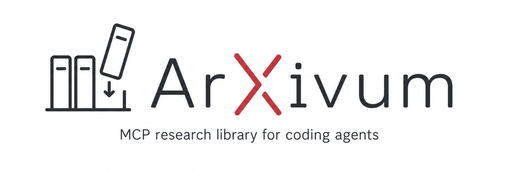

<p align="center">
  
</p>

<h1 align="center">ArXivum: Local-first MCP research library for coding agents</h1>

<p align="center">
  Discover, summarise, organise, and ideate over arXiv research papers
  entirely on your own machine. No cloud LLM calls. No data leaves your machine.
</p>

<p align="center">
  <a href="https://github.com/eddisonpham/Arxivum/blob/main/LICENSE"></a>
  
  
</p>

---

## What it does

- **Search arXiv** and import papers into a local library with one tool call.
- **Enrich** every paper with citation counts, venue, and impact data from
  Semantic Scholar. Free, no API key required.
- **Summarise** papers into structured sections: problem statement,
  methodology, findings, ablations, discussion, limitations, and an overall
  assessment. Generated by a local LLM.
- **Generate ideas** grounded in each paper's constraints, assumptions, and
  inductive biases. Each idea includes suggested search queries for
  novelty verification.
- **Verify novelty** by checking generated ideas against your local library
  and arXiv. The LLM judges overlap and returns a verdict: *likely novel*,
  *needs review*, or *similar exists*.
- **Query the library** with hybrid vector + metadata retrieval and
  cross-encoder reranking for precise results.
- **Supervise everything** through a visual web panel. Inspect papers,
  approve or reject ideas, and watch every agent action in real time.

Everything runs on your CPU or a small GPU. No cloud LLM calls. No data
leaves your machine.

## Quick start

### 1. Install

```bash
git clone <repo>
cd arxivum
python -m venv .venv
source .venv/bin/activate
pip install -e ".[dev,llm]"
```

On Windows, activate the venv with `.venv\Scripts\activate` instead.

The `[llm]` extra installs `llama-cpp-python`, which needs CMake and a C++
compiler. On Windows, install Visual Studio Build Tools first. Without
`[llm]`, everything works except local LLM generation (summaries, ideas,
novelty checks). You can still search, import, enrich, and query the library.

### 2. Configure

```bash
cp .env.example .env
```

Edit `.env` and add your `HF_TOKEN`. This is used only for downloading
models from Hugging Face Hub. No remote inference is performed.

### 3. Download models (~1.5 GB)

```bash
python scripts/download_models.py
```

This downloads BGE embedding and reranker models (cached by
sentence-transformers) and Qwen2.5-1.5B-Instruct GGUF (Q4_K_M, ~1 GB)
for local LLM inference.

### 4. Initialise the database

```bash
python scripts/migrate.py
```

### 5. Run

**MCP server** for coding agents (Claude Code, Cursor, Freebuff):

```bash
python -m src.mcp_server
```

Communicates over stdio by default. Set `MCP_TRANSPORT=sse` in `.env` for
SSE mode.

**Web API + visual panel** for human supervision:

```bash
python -m src.api.main
```

- Visual panel: `http://localhost:8000`
- Demo page: `http://localhost:8000/demo`
- API docs: `http://localhost:8000/docs`

## MCP tools

The server exposes nine tools, all prefixed with `research_`:

| Tool | Description |
|------|-------------|
| `research_search_papers` | Search arXiv, import results, optionally enrich and summarise. |
| `research_query_library` | Hybrid vector + metadata search over your local library. |
| `research_get_paper_details` | Full metadata, metrics, summaries, and ideas for a paper. |
| `research_remove_paper` | Remove a paper and all derived data. |
| `research_generate_summary` | Generate or retrieve structured summaries. |
| `research_generate_ideas` | Generate novel ideas from a paper's constraints. |
| `research_verify_novelty` | Re-verify an idea's novelty against the library and arXiv. |
| `research_list_library` | List papers with pagination and filters. |
| `research_get_activity_log` | Return recent agent actions for supervision. |

## Configuration

All settings come from environment variables loaded from `.env`.
See `.env.example` for the full list and defaults. Key options:

| Variable | Default | Purpose |
|----------|---------|---------|
| `DATA_DIR` | `./data` | SQLite database + ChromaDB location. |
| `MODELS_DIR` | `./models` | GGUF model file location. |
| `LLM_N_CTX` | `4096` | LLM context window size. |
| `LLM_N_THREADS` | `4` | CPU threads for LLM inference. |
| `LLM_N_GPU_LAYERS` | `0` | GPU layers to offload (0 = pure CPU). |
| `MCP_TRANSPORT` | `stdio` | MCP transport: `stdio` or `sse`. |
| `HF_TOKEN` | none | Hugging Face token (model download only). |

## Testing

```bash
pytest
```

Unit, component, and integration tests. Mocked and offline. Runs in ~3
seconds.

Smoke tests require real models and network access. Run them after
downloading models:

```bash
pytest tests/smoke/ -v -s
```

## How it works

```
Coding Agent ──MCP stdio──▶ MCP Server ──▶ arXiv API + Semantic Scholar
                                │
                    FastAPI + Visual Panel
                                │
                ┌───────────────┴───────────────┐
            ChromaDB                        SQLite
         (vectors)                     (metadata/ideas)
                                │
              llama-cpp-python (Qwen2.5-1.5B GGUF)
              sentence-transformers (BGE embed/rerank)
```

**Retrieval pipeline:**

1. arXiv search results are imported into SQLite (metadata) and ChromaDB
   (vector embeddings of abstracts and titles).
2. Semantic Scholar enrichment adds citation counts and venue data.
3. Generated summary sections are also indexed as vector chunks for
   fine-grained RAG retrieval.
4. Library queries use hybrid vector search with metadata pre-filtering,
   followed by cross-encoder reranking for precision.

**Memory management:** On constrained machines, only one heavy model
(embedder, reranker, or LLM) is resident at a time. The model manager
automatically unloads the previous model before loading the next.

## Scope

This is a **local-only POC**. All models, databases, and services run on
the user's machine. Cloud and HPC scaling is future work.

## License

MIT. See [LICENSE](LICENSE).
